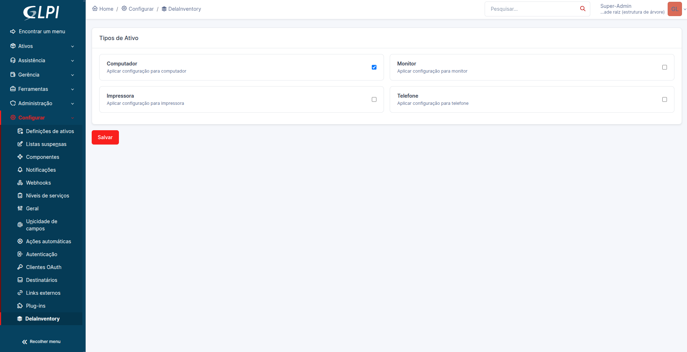
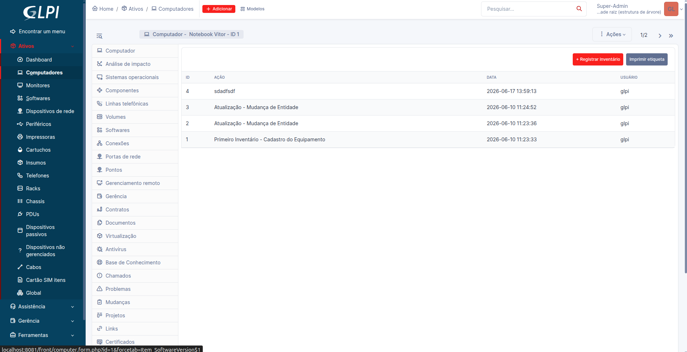

# 📦 Delainventory - Inventory Control and Label Printing for GLPI

Delainventory is a GLPI plugin designed to improve inventory traceability, audit history, and asset identification through automatic Zebra label printing.

The plugin adds a dedicated tab to GLPI assets, allowing users to register inventory checks, keep a complete audit history, and print asset labels containing QR Codes for quick access to equipment information.

> Built using the official GLPI plugin architecture, Delainventory integrates seamlessly with GLPI assets and uses ZPL (Zebra Programming Language) to print professional asset labels directly to Zebra printers.

<br>

   

## ✨ Features

- Manual inventory registration by users
- Complete inventory history for each asset
- Audit trail with user identification
- Support for multiple GLPI asset types
- Automatic asset label generation
- QR Code linking directly to the asset page in GLPI
- Direct ZPL printing to Zebra printers over TCP/IP
- Native integration with the GLPI interface

## 🖥️ Supported Assets

Currently supported asset types:

- Computers
- Monitors
- Printers
- Phones

The plugin architecture is designed to support additional GLPI asset types in future releases.

## 🏷️ Generated Label

Each label includes:

- Asset ID
- Asset description
- Serial number
- Assigned location or responsible entity
- QR Code for quick access to the asset in GLPI

Example:

```text
ASSET ID
00001

DESCRIPTION
Dell Latitude 5440 Notebook

SERIAL
ABC123XYZ

LOCATION
Headquarters

[ QR CODE ]
```

## 📂 Project Structure

```text
delainventory/
├── front/
│   ├── action.php
│   ├── config.php
│   └── print.php
│
├── inc/
│   ├── config.class.php
│   ├── log.class.php
│   └── setup.php
│
├── templates/
│   └── log.php
│
├── sql/
│   └── install.sql
│
├── hook.php
└── setup.php
```

## ⚙️ How It Works

### Inventory Registration

1. Open an asset in GLPI.
2. Navigate to the **Delainventory** tab.
3. Click **Register Inventory**.
4. Enter an optional note.
5. The inventory record is saved to the database.
6. The complete inventory history remains available for future audits.

### Label Printing

1. Open an asset in GLPI.
2. Click **Print Label**.
3. The plugin retrieves the asset information.
4. A ZPL label is generated dynamically.
5. The ZPL is sent directly to a Zebra printer via TCP/IP (port 9100).
6. The label is printed automatically.

## 🔧 Requirements

- GLPI
- PHP 8+
- MySQL or MariaDB
- Zebra printer compatible with ZPL
- Network connectivity between the GLPI server and the printer

## 🚀 Installation

Clone the repository into your GLPI plugins directory:

```bash
git clone https://github.com/VitorPaloco/delainventory.git
```

Install dependencies:

```bash
cd delainventory
composer install --no-dev
```

Enable the plugin through the GLPI administration panel:

```text
Setup → Plugins → Delainventory → Install → Enable
```

## 📸 Screenshots

### Inventory Tab



### Asset View



## 📈 Roadmap

- Printer IP and port configuration interface
- Custom ZPL template editor
- Support for additional GLPI asset types
- Export inventory history to Excel and PDF

## 👨‍💻 Author

Developed by **Vitor Paloco** to improve asset inventory management and traceability within GLPI.
